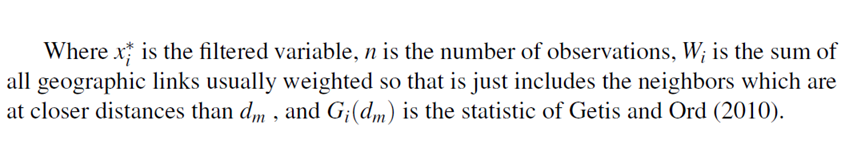

```{r setup, include=FALSE}
options(htmltools.dir.version = FALSE)
```

## Motivation:

- Regional disparity has been the main subject of many studies in Indonesia

- Only few studies have focused on disparity at district level and during decentralization process (Vidyattama 2013)

- Persistent income differences despite several policy efforts (Akita 1988; Garcia and Soelistianingsih 1998; Kataoka 2012)

## Research Objective:
  
- Study the spatio-temporal dynamics of income per capita accross districts in Indonesia over 2000-2017

## Methods:

- Spatial Autocorrelation Moran's I (Moran 1948, Anselin et. al 2006)

- Distributional convergence framework (Quah 1996; Hyndman et. al 1996)

- Getis Filter (Getis 1995)

## Data:

- 34 provinces and 514 districts over the 2000-2017 period.


---

class: middle

## Main Results:

1. **Significant Spatial Autocorrelation** at the districts level 

2. **Persistent Distributional Convergence** at middle income level distribution

3. **Convergence Clubs** at upper and lower distribution

4. **Filtered and non-filtered dynamic data ** spatial dependece helps to reduce disparities
  


---

class: middle

# Outline of this presentation

1. **Some Stylized Facts **

  - Convergence at Provincial level
  - Convergence at Districts level
  - Spatial Dependence at Districts level

2. **Convergence Framework** 

  - Distributional Dynamic Framework 
  - Distributional Dynamic (Intuition)
  - Getis Spatial Filter
    
3. **Main Results**
  - Distributional convergence and clusters for several years rates
      - Convergence clubs
  - Distributional convergence and clusters for dynamic transitions rates
      - Spatial effects reduce polarization
  

---
class: center, middle

# (1) Some Stylized Facts

Convergence at provincial and districts levels

Spatial dependence at districts level
---

class: center, middle

#Convergence at Provincial level


---

class: center, middle

#Convergence at Districts level


---
class: center, middle

##Does the economic performance of neighbouring regions determine the regional convergence? 
"Strong sign of Spatial Autocorrelation Moran's I at Districts level"


$$I = \frac{\sum_i\sum_j w_{ij} z_i.z_j}{\sum_i z_i^2} = \frac{\sum_i (z_i \times \sum_j w_{ij} z_j)}{\sum_i z_i^2}.$$


Figure 3. Univariate and Differential Moran's I at Districts level.
---

class: center, middle

# (2) Convergence Framework

Distributional Dynamic Framework 

Distributional Dynamic (Intuition)

Getis Spatial Filter

---
class: middle, center

# The distribution dynamics framework


---
class: middle, center

# The distribution dynamics framework (intuition)


---
class: center, middle

# Getis Spatial Filter

Conducting Getis Spatial Filter to solve the problem of a violation of independence assumption that cause misguided inferences and interpretations (Rey and Janikas, 2005).


$$x_i^* = \frac{xi(W_i)}{(n-1)G_i(d_m)}$$




---

class: center, middle

# (3) Main Results

Distributional convergence and clusters for several years rates

Distributional convergence and clusters for dynamic transitions rates
  
---

class: middle, center

#Distributional convergence and clusters 
##several years rates


Figure 4. Distributional convergence and clusters for several years rates
---
class: middle, center

#Distributional convergence and clusters 
##dynamic transitions rates


Figure 5. Distributional convergence and clusters for dynamic transitions rates

---

#Concluding Remarks

## Inequality still matters 

- Converge clubs at small group of pooreer and richer.
- Most regions (medium income level) are persistent.

## However,neighboring districs play an important role
- The economic performance of the districts in general was likely tend to be influenced positively by neighboring districts's performance.
- Significant role of neighbors effects in reducing inequality. 

## Implications 

- Call for better coordination of regional policies at the cluster level.
- Enhance interregional connectivity and cooperation.
- For further research : 
  - What is the role of geographical neighbors in accelerating  convergence?
  - Conducting similar approach for different development indicator, such as Human Development Index


---

class: center, middle

# Thank you very much for your attention

you can find this presentation on our QuaRCS lab website 
https://quarcs-lab.rbind.io/

 

**Quantitative Regional and Computational Science Lab**


